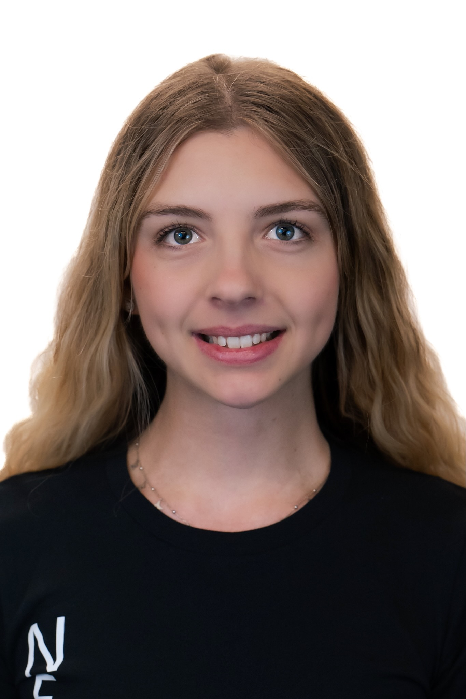
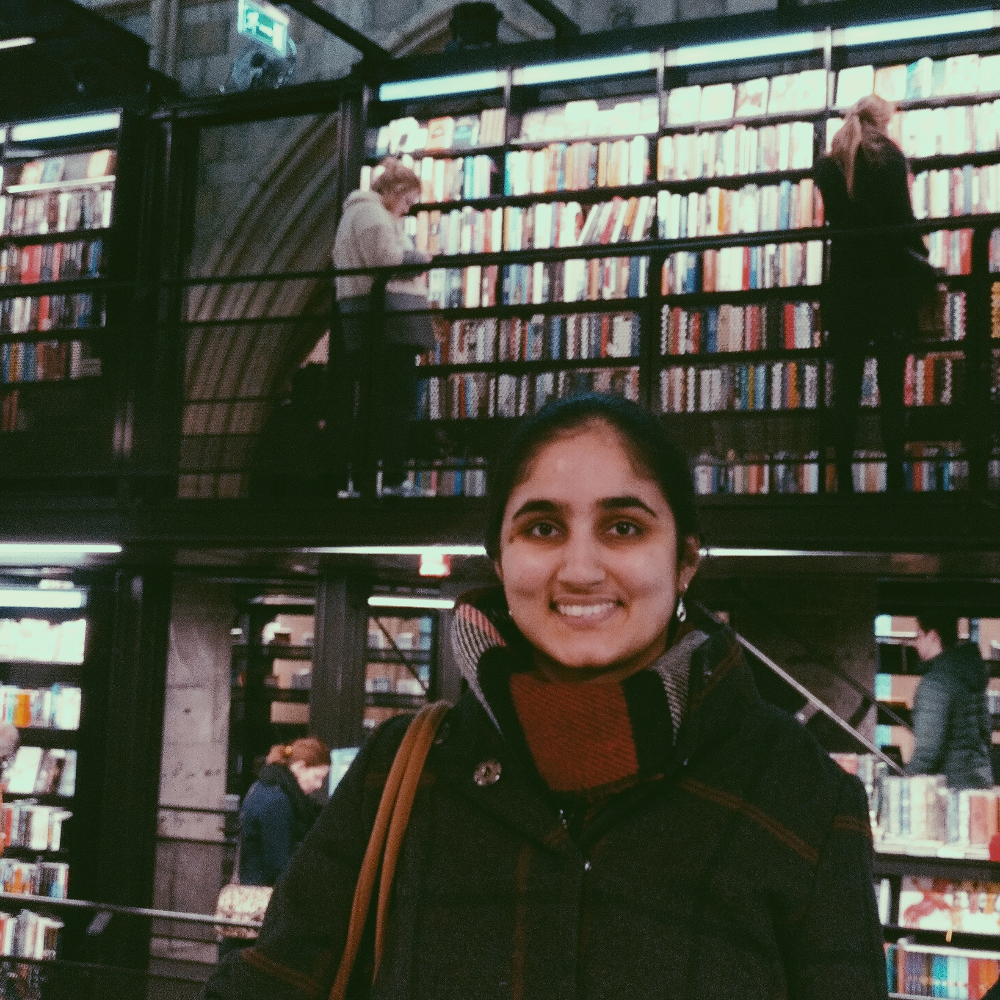
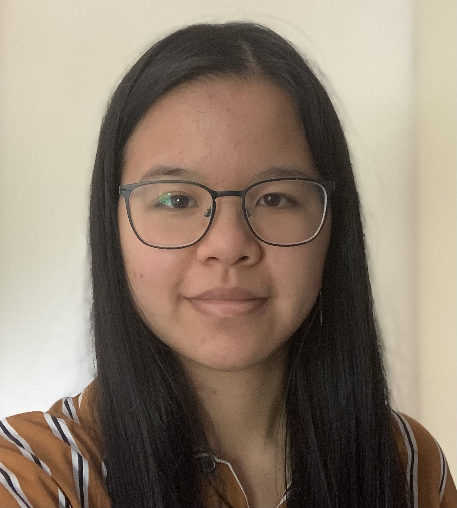
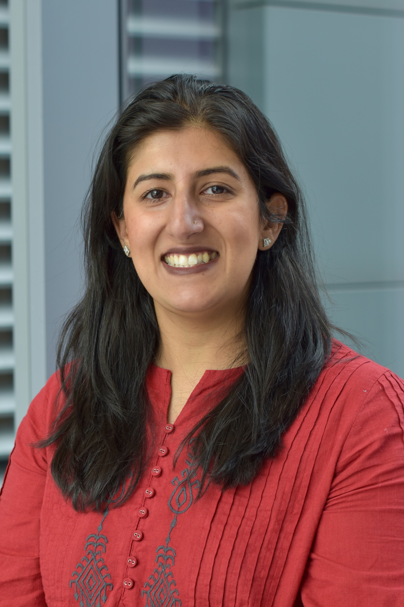
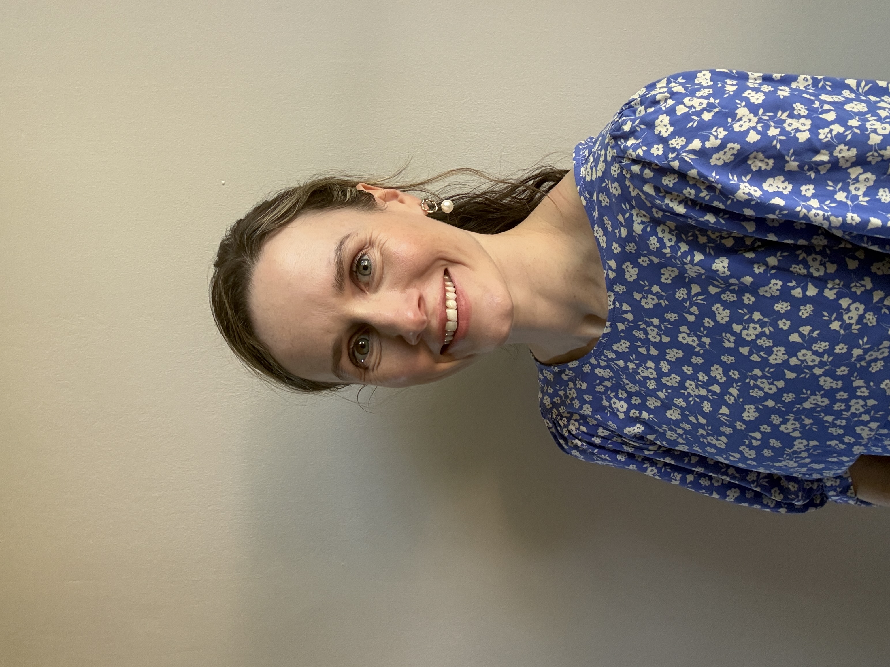

# Meet Your Faculty

#### Shamini Ayyadhury (She/Her)

>Founder, CEO  
Panoramics - A Vision Inc.  
Toronto, Ontario, Canadav  
Shamini.Ayyadhury@panoramics-a-vision.com

Dr. Shamini Ayyadhury is the Founder and CEO of Panoramics - A Vision, a life sciences corporation dedicated to biological topography, and the Chair of True North Spatial, Canada's national summit on spatial and single-cell biology. Through The Panoramic Chapters, she collaborates with the Canadian Bioinformatics Workshops to develop meaningful, creative workshops for the spatial and single-cell community.
She is a Scientific Associate at the University Health Network and was previously a postdoctoral fellow in spatial biology and computer vision at the University of Toronto. She holds a PhD in Neuroscience from McGill University, a Master's from Imperial College London, and a BSc from the National University of Singapore.
Outside science, she boxes and makes art.

#### Alyona Ivanova (She/Her)

>PhD Candidate  
University of Toronto, The Hospital for Sick Children  
Toronto, Ontario, Canada  
alyona.ivanova@mail.utoronto.ca

Alyona is a graduate student at the University of Toronto pursuing PhD in Medical Sciences. Her research focuses on identifying novel therapies for targeting chemo-resistance in glioblastoma using spatial ‘omics technologies. She works in close collaboration with clinicians, neuropathologists, scientists bridging the gap between clinical practice and fundamental lab research. Alyona is a Creative Director of Panoramics - A Vision, and an Executive Editor and Director of Distribution of the Institute of Medical Sciences Magazine. 

#### Melanie Peralta (She/Her)

>Laboratory manager - MLT  
Mount Sinai Hospital  
Toronto, Ontario, Canada  
melanie.peralta@sinaihealth.ca 

Melanie is a Laboratory Manager at Mount Sinai Services. She is a Certified Medical Laboratory Technologist in good standing with the College of Medical Laboratory Technologists of Ontario. Her specialties are in Histology and Immunohistochemistry. In the past 25 years she has worked closely with researchers from UHN, U of T, LTRI, Mount Sinai Hospital and other institutions. Her work has been published in a few journals and presentations which include RNAscope, Visium, Visium HD and Xenium. She has also worked as a lab instructor for The Michener Institute bridging program for international laboratory technologists. Her passion in teaching, research, and leadership is ensuring that knowledge is shared among future researchers in years to come.  
#### Zhibin Lu (He/Him)

>Senior Manager and Architect, Digital Research  
University Health Network  
Toronto, Ontario, Canada  
zhibin@gmail.com  

Zhibin Lu is a senior manager at University Health Network Digital. He is responsible for UHN HPC operations and scientific software. He manages two HPC clusters at UHN, including system administration, user management, and maintenance of bioinformatics tools for HPC4health. He is also skilled in Next-Gen sequence data analysis and has developed and maintained bioinformatics pipelines at the Bioinformatics and HPC Core. He is a member of the Digital Research Alliance of Canada Bioinformatics National Team and Scheduling National Team.

## TA's

#### Chaitra Sarathy, PhD (She/Her)

>Bioinformatics Specialist, Neuron2Brain Lab (https://neurontobrainlaboratory.ca/)  
Krembil Research Institute, University Health Network  
Toronto, Ontario, Canada

Dr. Sarathy is Bioinformatics Researcher specializing in mathematical modeling and multi-omics integration, including bulk and single-cell RNA-seq analysis. Over the years, she has developed open-source, reproducible workflows for target discovery and machine learning models for patient stratification. Currently, she leads bioinformatics efforts at N2BL in Krembil Research Institute (https://neurontobrainlaboratory.ca/) focused on integrating multi-modal data to uncover disease mechanisms underlying neurological diseases. As a certified Carpentries Instructor, she is passionate about teaching and helping researchers build confidence in analyzing high-dimensional omics data. She likes to draw on her experiences across the software industry, academic research, and clinical settings to make her teaching practical and grounded in real-world scientific questions. 

#### Dina Karamboulas, PhD 

>Scientific Associate  
University Health Network  
Toronto, Ontario, Canada  
dina.karamboulas@uhn.ca

Dina is a Scientific Associate in the Uro-Oncology Research Unit at the University Health Network and holds a PhD in Anatomy & Cell Biology from the University of British Columbia (UBC). She specializes in computational genomics and bioinformatics, with expertise in analyzing single-cell and spatial omics datasets, including scRNA-seq, scATAC-seq, scMultiome-seq, Xenium, and MERSCOPE. Her work has focused on uncovering the molecular mechanisms underlying brain development and adult brain function. She has developed robust computational pipelines for large-scale data analysis using Python, R, and Linux-based workflows. As a part-time Data Analyst at Astraea Bio, she applies spatial transcriptomics approaches to identify cellular phenotypes and characterize tissue architecture. 

#### Joan Kant 

>Sr. Bioinformatics Analyst   
University Health Network  
Toronto, Ontario, Canada  
Joan.Kant@uhn.ca

Joan obtained her BSc and MSc in Biomedical Engineering at Eindhoven University of Technology in The Netherlands. During her studies she became interested in using computational biology/bioinformatics to study cancer. In 2022, she moved to Toronto for an internship in the Gaiti Lab studying cell-cell-communication in glioblastoma using scRNAseq. Following her internship, she transitioned to a Bioinformatics Analyst role, and now leads the spatial omics analyses across multiple projects in the Gaiti Lab.

## Facilitators

#### Neha Ratti (she/her)

>Regional Coordinator, CBH Ontario  
Canadian Bioinformatics Hub, University Health Network   
Toronto, ON, Canada 
>
> --- ontario@bioinformatics.ca 

Neha is passionate about advancing bioinformatics and data science training across the province. With a strong background in project management, event coordination, and stakeholder engagement, she strives to create impactful initiatives that foster collaboration and skill development. Her experience in organizing training programs, developing policies, and building supportive environments enables her to contribute to Ontario’s leadership in the bioinformatics community. 

#### Sian Brooks (she/her)

>Regional Coordinator, CBH Ontario  
Canadian Bioinformatics Hub, University Health Network   
Toronto, ON, Canada 
>
> --- ontario@bioinformatics.ca 

Sian Brooks is the Ontario Co-Regional Coordinator for the Canadian Bioinformatics Hub. With over eight years of experience in the healthcare field and a background in office administration and event coordination, Sian brings a steady, detail-oriented approach to program delivery. She is committed to fostering a collaborative and supportive environment for trainees and researchers alike, helping to strengthen Ontario's standing within the national bioinformatics community.

